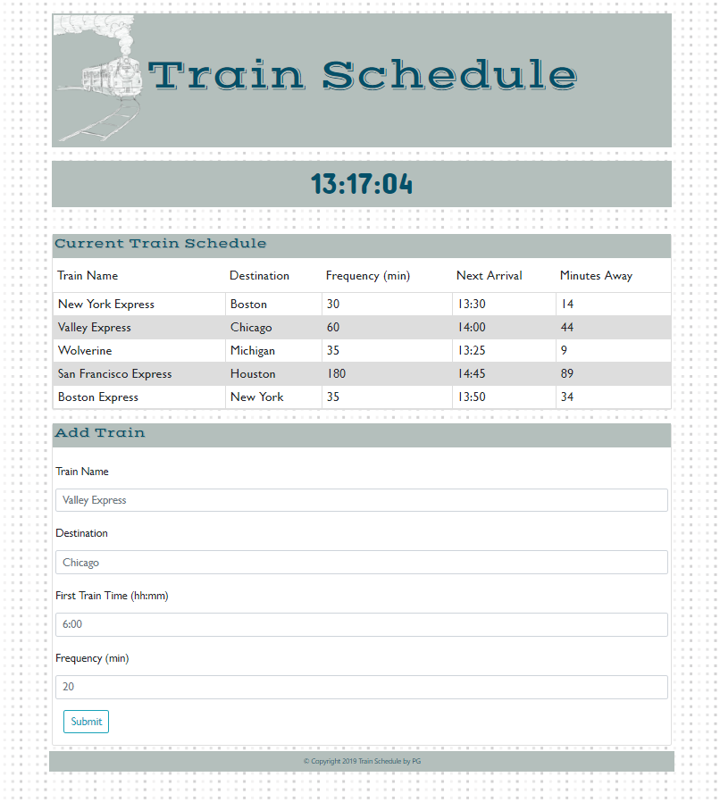
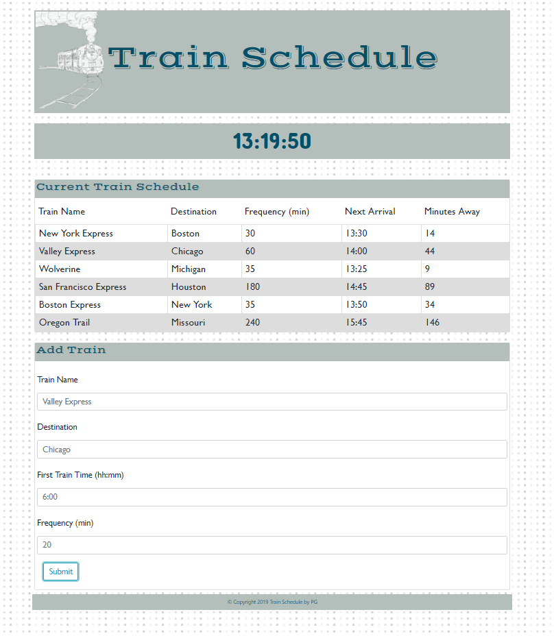

# train-schedule
---------------
## Table of Contents
1. [Abstract](#abstract)
2. [Coding Overview](#overview)
3. [Application Display](#display)

## Abstract

The application allows a user to add a train with a name, destination, frequency, and first train's departure time. Once the user submits their input, it is sent to the Firebase database and uploaded from the database to the current train schedule table. The application also calculates the next train arrival time and how far the next train is.

## Coding Overview

The application is built with;
* HTML
* CSS
* Bootstrap
* JavaScript
* jQuery
* Firebase

Application link is : https://pinargultekin.github.io/train-schedule/

## Application Display

 

